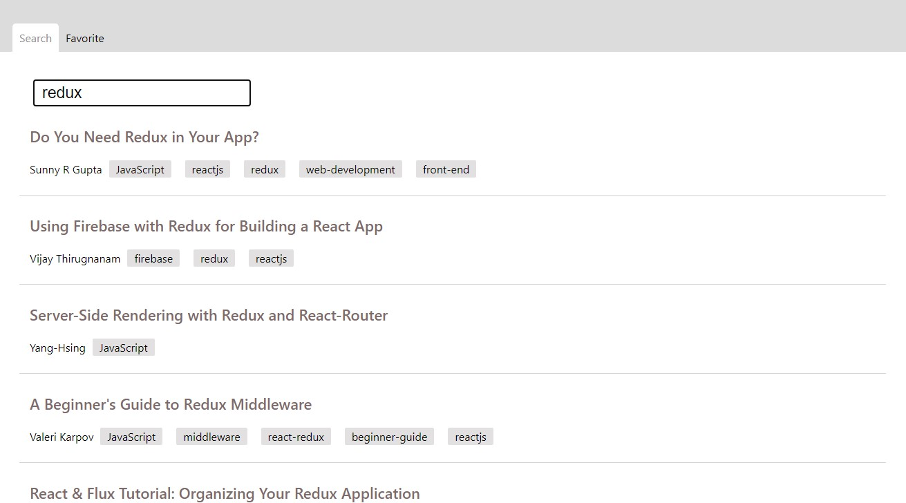

## Project purpose

this is a demo project for **algolia search** engine

please download project by
```bash
git clone git@github.com:Jadson666/play-with-algolia.git
```
and before you run project at local, your should prepare env variable first
to do so, add `.env` file at root and refer to `.env.example` as it's content
## Run on production mode


1. run `yarn serve` at root folder
2. then open [127.0.0.1:3000/search](http://127.0.0.1:3000/search) in your browser

## Run on dev mode (not recommended, prefetch will be disabled)
run `yarn watch`

## Execute testing

just run `yarn test` in your root folder

---

## Demo

public demo site
- CodeSandbox: https://tpzoy.sse.codesandbox.io/search
## Preview


